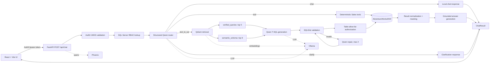

# Enterprise Conversational AI Agent

An authenticated, retrieval-augmented conversational analytics application for the `AdventureWorks2022` SQL Server `Sales` schema. It combines a React chat UI, FastAPI orchestration, local Ollama models, Qdrant retrieval, deterministic analytics tools, SQLGlot validation, SQL-backed RBAC, result masking, and Phoenix/OpenTelemetry tracing.

This is a production-style reference implementation, not a finished production deployment. Read [Current limitations](#current-limitations) before exposing it to real users.

## What the application does

For every message, the backend authenticates the caller and resolves their database permissions before choosing exactly one route:

1. **Chat** - answers greetings, thanks, and capability questions without accessing data.
2. **Deterministic tool** - runs one of five fixed, parameterized Sales analytics workflows.
3. **Text-to-SQL** - retrieves schema context and verified examples, generates one T-SQL query, validates and authorizes it, executes it, masks configured sensitive fields, and summarizes the result.
4. **Clarification** - asks a focused follow-up when the business meaning is materially ambiguous.

Unsafe or repeatedly unsuccessful operations return a structured `requires_human_review` state. The project does not currently connect that state to a ticketing or human-approval system.

### Key capabilities

- Auth0 RS256 access-token validation with issuer and audience checks
- SQL Server-backed user, role, and table permission lookup
- Fast structured routing with a no-model shortcut for simple chat
- Five allow-listed, deterministic Sales analysis tools
- RAG-assisted Text-to-SQL using two independent Qdrant collections
- A curated semantic model covering 19 Sales tables, 33 relationships, and 8 metrics
- 150 verified natural-language-to-SQL retrieval examples
- Single-statement, read-only Sales SQL validation with SQLGlot
- Per-table authorization for generated SQL
- Up to two bounded SQL repair attempts
- Exact-name masking for selected credit-card result fields
- Grounded natural-language answer generation from bounded result previews
- Stage-level timeouts and controlled `500`/`504` responses
- OpenTelemetry traces exported to Arize Phoenix
- Authenticated React chat UI with collapsible SQL and structured data

## Architecture



### Request lifecycle

1. `main.py` creates a root `chat.request` span, request ID, and overall request timeout.
2. FastAPI validates the JSON body and the Auth0 bearer token.
3. The API loads the active user's role and table allow-list from the `rbac` SQL schema.
4. The router returns a schema-constrained `RouteDecision` with `chat`, `tool`, `text_to_sql`, or `clarify`.
5. The orchestrator runs one bounded path: fixed chat, deterministic tool, clarification, or retrieval-assisted Text-to-SQL.
6. Successful data paths invoke answer generation if no answer has already been supplied.
7. The API returns a `ChatResult` containing the answer, route, optional SQL/data, metadata, request ID, and trace ID.

Each API request is independent. The browser retains visible messages for the current page session, but conversation history is not sent to the backend or used by the models.

## Technology stack

| Layer | Technology |
| --- | --- |
| Frontend | React 18, TypeScript, Vite 5, Auth0 React SDK |
| API | FastAPI, Pydantic 2, Uvicorn |
| LLM runtime | Ollama with `qwen2.5:7b` |
| Embeddings | Ollama with `nomic-embed-text` |
| Retrieval | Qdrant cosine-vector collections |
| Database | Microsoft SQL Server, `AdventureWorks2022`, `pyodbc` |
| SQL safety | SQLGlot using the T-SQL dialect |
| Authentication | Auth0 OAuth 2.0/OIDC access tokens, RS256 JWKS |
| Authorization | Application RBAC tables in SQL Server |
| Observability | OpenTelemetry OTLP/HTTP and Arize Phoenix |
| Packaging | Docker Compose, Python 3.12 image, Node 20 image |

## Deterministic analytics tools

The router sees only each tool's name, description, and JSON parameter schema. Tool implementations use static SQL and parameterized filters.

All tools accept optional inclusive ISO-8601 `start_date` and `end_date` values. An omitted date range means all available history.

| Tool | Optional entity filter | Main outputs |
| --- | --- | --- |
| `get_sales_performance` | `territory_id` | Revenue, total due, order/customer counts, AOV, online/offline channel mix, monthly trends, territory rankings |
| `get_customer_analysis` | `customer_id` | Top-20 customer rankings or one customer's metrics, purchase reasons, and payment-card type distribution |
| `get_salesperson_performance` | `salesperson_id` | Revenue, order metrics, quota attainment, rankings, monthly trends, and territory assignment history |
| `get_promotion_performance` | `special_offer_id` | Offer/product coverage, orders, units, line revenue, discount rates, rankings, and monthly performance |
| `get_currency_sales_analysis` | `country_region_code` | Territory sales, local currency mappings, monthly sales, and recorded exchange-rate distributions |

The currency tool deliberately does not convert recorded amounts because the code does not assume an exchange-rate direction.

## Text-to-SQL and retrieval

The Text-to-SQL path builds context from:

- the five nearest entries in the `verified_queries` collection;
- the eight nearest chunks in the `semantic_schema` collection; and
- canonical global anti-hallucination rules from `sales_business_rules.json`.

The semantic source files under `backend/app/sales/schema/` contain:

- `sales_schema.json` - 19 tables, their columns/grain/keys, 33 relationships, and 8 canonical metrics;
- `sales_business_rules.json` - global rules plus table-specific financial, grain, enum, and join guidance;
- `verified_queries.json` - 150 curated examples (116 easy and 34 medium in the current dataset).

`nomic-embed-text` documents use the `search_document:` prefix and user questions use `search_query:`. Both Qdrant collections use cosine distance and deterministic UUIDs so indexing can be repeated safely.

Generated SQL must:

- parse as exactly one T-SQL statement;
- contain a `SELECT` (or supported select-like root);
- contain no DML, DDL, `EXEC`, command, or `INTO` nodes;
- use only fully qualified `Sales.<table>` references;
- use only tables in the curated semantic schema; and
- reference only tables allowed for the authenticated user's role.

Validation or execution failures are sent to the repair model with the original question, failed SQL, error, and the same retrieval context. The orchestrator allows at most two repair attempts.

## Authentication and authorization

### Auth0

The frontend uses an Auth0 Single Page Application and requests an access token for `VITE_AUTH0_AUDIENCE`. The backend accepts only bearer tokens that:

- use `RS256`;
- verify against `https://<AUTH0_DOMAIN>/.well-known/jwks.json`;
- have issuer `https://<AUTH0_DOMAIN>/`;
- contain the configured audience; and
- contain a non-empty `sub` claim.

For local development, configure these Auth0 application URLs:

- Allowed Callback URLs: `http://localhost:3000`
- Allowed Logout URLs: `http://localhost:3000`
- Allowed Web Origins: `http://localhost:3000`

Create an Auth0 API whose identifier exactly matches both `AUTH0_AUDIENCE` and `VITE_AUTH0_AUDIENCE`.

### SQL-backed RBAC contract

After token validation, the backend uses the token's `sub` value to query four tables. No migration or seed script is included, so these tables and records must already exist:

| Table | Columns used by the application |
| --- | --- |
| `rbac.AppUsers` | `UserId`, `AuthSubject`, `Email`, `IsActive` |
| `rbac.UserRoles` | `UserId`, `RoleId` |
| `rbac.Roles` | `RoleId`, `RoleName` |
| `rbac.RoleTablePermissions` | `RoleId`, `SchemaName`, `TableName` |

An authenticated subject without an active user/role mapping receives `403 Forbidden`. Generated SQL is denied if any physical table reference is missing from the resulting `SchemaName.TableName` allow-list.

Important: table-level authorization is currently applied only to generated Text-to-SQL statements. Deterministic tools require an authenticated, mapped application user, but their static queries are not compared with that user's table allow-list.

### Result masking

All SQL execution results pass through recursive exact-key masking before they reach answer generation, traces, or the API response. The configured sensitive names are:

- `CardNumber` - all but the last four characters are replaced with `*`;
- `ExpMonth`;
- `ExpYear`; and
- `CreditCardApprovalCode`.

The final three fields are fully replaced with `*`. Aliasing a sensitive database column to a different result name is not currently detected.

## Prerequisites

- Python 3.12+ (the backend container uses 3.12)
- Node.js 20+ and npm
- Microsoft SQL Server with `AdventureWorks2022`
- Microsoft ODBC Driver 18 for SQL Server on the backend host
- Ollama running locally or at a reachable URL
- `qwen2.5:7b` and `nomic-embed-text` pulled into Ollama
- Qdrant
- An Auth0 SPA, Auth0 API, and matching SQL RBAC records
- Phoenix is optional for application behavior but included for trace inspection
- Docker and Docker Compose if using the provided infrastructure services

## Local development setup

Run commands from the `enterprise-ai-agent` repository root unless a step says otherwise.

### 1. Configure SQL Server and RBAC

Restore or attach `AdventureWorks2022`, ensure the 19 expected `Sales` tables are available, create the four `rbac` tables described above, and map each Auth0 `sub` to an active user, role, and table permissions.

The backend selects SQL authentication when both `DB_USER` and `DB_PASSWORD` are non-empty. Otherwise it uses Windows trusted authentication.

### 2. Configure backend environment variables

```powershell
Copy-Item .env.example .env
```

On macOS/Linux, use `cp .env.example .env`. Replace the database and Auth0 values in `.env`.

If SQL Server uses a non-default port, include it in `DB_SERVER` using the format supported by the ODBC driver, for example `DB_SERVER=localhost,1433`. The current connection builder does not consume the separate `DB_PORT` setting.

### 3. Configure the frontend Auth0 client

```powershell
Copy-Item frontend/.env.example frontend/.env
```

Set the frontend domain, public SPA client ID, and API audience. The frontend intentionally fails at startup if any value is absent.

### 4. Start Qdrant and Phoenix

Compose can run only the infrastructure dependencies while the application runs on the host:

```bash
docker compose up -d qdrant phoenix
```

- Qdrant API/dashboard: `http://localhost:6333`
- Phoenix UI and OTLP receiver: `http://localhost:6006`

### 5. Start Ollama and pull the models

```bash
ollama serve
ollama pull qwen2.5:7b
ollama pull nomic-embed-text
```

If Ollama already runs as a service, only the two `pull` commands are needed.

### 6. Install and start the backend

```bash
cd backend
python -m venv .venv
```

Activate it on Windows:

```powershell
.venv\Scripts\Activate.ps1
```

or on macOS/Linux:

```bash
source .venv/bin/activate
```

Then install and run:

```bash
python -m pip install -r requirements.txt
uvicorn app.main:app --reload --host 127.0.0.1 --port 8000
```

FastAPI exposes interactive documentation at `http://localhost:8000/docs` and ReDoc at `http://localhost:8000/redoc`. There is no dedicated health endpoint.

### 7. Build the retrieval indexes

With Ollama and Qdrant running, execute from `backend/`:

```bash
python -m app.retrieval.index_verified_queries --recreate
python -m app.retrieval.index_semantic_schema --recreate
```

Use `--recreate` after changing embedding models or when a clean rebuild is required. Without it, deterministic IDs are upserted into existing collections.

### 8. Install and start the frontend

In a second terminal:

```bash
cd frontend
npm ci
npm run dev
```

Open `http://localhost:3000`. Vite proxies `/api` to `http://127.0.0.1:8000` by default.

## Docker Compose

| Service | Host port | Notes |
| --- | --- | --- |
| `frontend` | `3000` | Vite development server; proxies `/api` to `backend:8000` |
| `backend` | `8000` | FastAPI; reads the root `.env` |
| `qdrant` | `6333` | Persistent `qdrant_storage` volume |
| `phoenix` | `6006` | Persistent `phoenix_data` volume |

The backend container overrides service URLs to use `host.docker.internal` for Ollama and Compose DNS names for Qdrant/Phoenix.

```bash
docker compose up --build
```

The full command is not turnkey: `backend/Dockerfile` installs UnixODBC development packages but not Microsoft's `msodbcsql18` runtime driver. Add that driver before relying on containerized SQL Server access. SQL Server and Ollama also remain external to this Compose file.

After startup, create the Qdrant indexes inside the backend container or against the exposed host services.

## API reference

### `POST /api/chat`

Requires `Authorization: Bearer <Auth0 access token>` and:

```json
{
  "message": "Show total sales revenue by territory in 2013"
}
```

`message` must contain at least one character. Whitespace-only input passes request validation but is rejected by the orchestrator.

```bash
curl -X POST http://localhost:8000/api/chat \
  -H "Authorization: Bearer $ACCESS_TOKEN" \
  -H "Content-Type: application/json" \
  -d '{"message":"Show total sales revenue by territory in 2013"}'
```

Response shape:

```json
{
  "status": "success",
  "route": "text_to_sql",
  "tool_name": null,
  "sql": "SELECT ...",
  "answer": "...",
  "data": [],
  "message": null,
  "metadata": {
    "repair_attempts": 0,
    "trace_id": "32-character hexadecimal trace ID",
    "request_id": "UUID"
  }
}
```

| Field | Meaning |
| --- | --- |
| `status` | `success`, `clarification_required`, `requires_human_review`, or `error` |
| `route` | `chat`, `tool`, `text_to_sql`, or `null` |
| `tool_name` | Selected deterministic tool, if applicable |
| `sql` | Normalized generated SQL on success, or last failed SQL during escalation |
| `answer` | User-facing answer when available |
| `data` | JSON-serializable rows/tool result; `null` for simple chat and some failures |
| `message` | Clarification, escalation, or status message |
| `metadata` | Route-specific details plus request/trace IDs |

| HTTP status | Cause |
| --- | --- |
| `200` | Successful route, clarification, handled authorization denial, or structured human-review result |
| `401` | Missing or invalid Auth0 bearer token |
| `403` | Authenticated subject has no active SQL RBAC mapping |
| `422` | Invalid request body, including an empty string |
| `504` | Overall request or bounded stage timeout |
| `500` | Unexpected unhandled request failure |

A generated query that requests unauthorized tables returns `200` with `status: "error"` and a safe denial message; denied table names are placed in metadata.

## Configuration reference

Pydantic loads the backend `.env` from the repository root. Variables absent from `.env.example` can still override matching `Settings` fields.

### Backend and data services

| Variable | Default/example | Purpose |
| --- | --- | --- |
| `APP_NAME` | `Enterprise Conversational AI Agent` | FastAPI title and OpenTelemetry service name |
| `DB_SERVER` | `localhost` | SQL Server host/instance; include port here when necessary |
| `DB_PORT` | `1433` | Present in settings but currently unused by the connection string |
| `DB_NAME` | `AdventureWorks2022` | SQL Server database |
| `DB_USER` | `sa` in example | SQL login; used only when both user and password are set |
| `DB_PASSWORD` | example placeholder | SQL login password; never commit the real value |
| `DB_TRUSTED_CONNECTION` | `true` | Enables trusted auth when SQL credentials are absent |
| `DB_TRUST_SERVER_CERTIFICATE` | `true` | Controls ODBC `TrustServerCertificate` |
| `DB_DRIVER` | `ODBC Driver 18 for SQL Server` | Installed ODBC driver name |
| `OLLAMA_BASE_URL` | `http://localhost:11434` | Ollama chat and embedding API base URL |
| `OLLAMA_MODEL` | `llama3.2` | Used only by the placeholder `OllamaClient`, not active Qwen calls |
| `OLLAMA_EMBED_MODEL` | `nomic-embed-text` | Retrieval embedding model |
| `QDRANT_URL` | `http://localhost:6333` | Qdrant service URL |
| `PHOENIX_ENDPOINT` | `http://localhost:6006/v1/traces` | OTLP/HTTP trace endpoint |
| `PHOENIX_PROJECT_NAME` | `enterprise-conversational-agent` | Phoenix project name/header |
| `TRACE_RESULT_PREVIEW_ROWS` | `5` | Maximum list rows included in trace previews |
| `AUTH0_DOMAIN` | required | Auth0 tenant domain without scheme |
| `AUTH0_AUDIENCE` | required | Auth0 API identifier/audience |

The active router, SQL generator, repair, and answer generator use the code constant `qwen2.5:7b`; they do not read `OLLAMA_MODEL`.

### Timeouts

| Variable | Default | Stage |
| --- | ---: | --- |
| `REQUEST_TIMEOUT_SECONDS` | `120` | Entire `/api/chat` request, including dependencies |
| `ROUTER_TIMEOUT_SECONDS` | `15` | Route decision |
| `TEXT_TO_SQL_TIMEOUT_SECONDS` | `30` | SQL generation |
| `SQL_REPAIR_TIMEOUT_SECONDS` | `30` | Each repair call |
| `ANSWER_GENERATION_TIMEOUT_SECONDS` | `30` | Grounded answer generation |
| `RETRIEVAL_TIMEOUT_SECONDS` | `30` | Qdrant/embedding retrieval |
| `TOOL_TIMEOUT_SECONDS` | `20` | Deterministic tool wrapper |
| `SQL_EXECUTION_TIMEOUT_SECONDS` | `15` | ODBC query timeout and async wrapper |

The frontend aborts chat requests after 130 seconds, slightly after the backend's default overall limit.

### Frontend

| Variable | Required | Purpose |
| --- | --- | --- |
| `VITE_AUTH0_DOMAIN` | Yes | Auth0 SPA tenant domain |
| `VITE_AUTH0_CLIENT_ID` | Yes | Public Auth0 SPA client ID |
| `VITE_AUTH0_AUDIENCE` | Yes | Auth0 API identifier; must match backend |
| `VITE_API_PROXY_TARGET` | No | Vite `/api` proxy; defaults to `http://127.0.0.1:8000` |

## Observability

Tracing starts during the FastAPI lifespan and is non-fatal: exporter initialization or shutdown problems are logged but do not stop the app.

Spans include `chat.request`, `router.decide`, both retrievals, `text_to_sql.generate`, `sql.validate`, `sql.authorize`, `sql.execute`, `sql.repair`, `tool.execute`, `answer.generate`, clarification/escalation, and response finalization. They capture route/tool names, durations, model token counts when available, retrieval scores, validation/authorization outcomes, bounded result previews, errors, request IDs, and trace IDs.

## Testing and verification

### Backend unit and mocked integration tests

Run from `backend/` so `app` is importable:

```bash
cd backend
python -m pytest tests -p no:cacheprovider -k "not live_timing_breakdown"
```

This excludes the real service-dependent timing test while covering timeouts, chat routing, masking, table authorization, and the mocked end-to-end revenue flow. `test_sql_validator.py` and `test_text_to_sql.py` currently contain placeholder assertions only.

### Live end-to-end performance test

This requires Ollama, both Qdrant indexes, SQL Server, valid environment configuration, and accessible data:

```bash
cd backend
python -m pytest tests/test_e2e_performance.py::test_e2e_revenue_2013_live_timing_breakdown -s -p no:cacheprovider
```

It measures routing, retrieval, generation, validation, authorization, execution, answer generation, and total latency. It constructs authorization context directly and does not exercise Auth0 or the HTTP boundary.

### Frontend build

```bash
cd frontend
npm ci
npm run build
```

### Legacy Qwen benchmark assets

`test/` contains a 20-case `SalesOrderHeader` benchmark, a six-case failed subset, runner, and saved result snapshot. The snapshot records 20/20 execution successes and 17/20 semantic matches.

The runner is legacy code and currently imports the removed `generate_text_to_sql_qwen` function. Treat the saved JSON as historical evidence, not a current result, until the runner is migrated to the async structured generation API.

## Maintaining schema and retrieval data

### Extracting raw SQL Server metadata

From `backend/`:

```bash
python scripts/extract_schema.py Sales
```

The extractor reads SQL environment settings and writes `sales_schema.json` into the current directory. It collects tables, columns, types, descriptions, primary keys, and foreign-key relationships.

Do not blindly replace `app/sales/schema/sales_schema.json` with raw output. The runtime semantic file also contains curated qualified names, business definitions, grain, join metadata, and metrics that the extractor does not generate. Review and enrich extracted changes, then rebuild `semantic_schema`.

### Updating prompts

Prompt files live in `backend/app/prompts/`. The loader treats versions as immutable: add a new `*_vN.txt` file and update the caller instead of editing an existing version for behavioral changes.

Rebuild the affected Qdrant collection after changing verified queries, schema semantics, business rules, or the embedding model.

## Project structure

```text
enterprise-ai-agent/
|-- backend/
|   |-- app/
|   |   |-- api/                 # Authenticated /api/chat endpoint
|   |   |-- auth/                # Auth0 validation and SQL RBAC
|   |   |-- core/                # Settings, timeouts, logging helper
|   |   |-- db/                  # ODBC, SQL validation and execution
|   |   |-- llm/                 # Structured Qwen calls and answers
|   |   |-- observability/       # OpenTelemetry/Phoenix tracing
|   |   |-- orchestration/       # Router, orchestrator, clarification
|   |   |-- prompts/             # Versioned model prompts
|   |   |-- retrieval/           # Embeddings, Qdrant, indexing, context
|   |   |-- sales/               # Tools and semantic source data
|   |   |-- security/            # Result masking
|   |   `-- tools/               # Tool registry and contracts
|   |-- scripts/                 # Raw schema extractor
|   |-- tests/                   # Unit, mocked, and live tests
|   |-- Dockerfile
|   `-- requirements.txt
|-- frontend/
|   |-- src/
|   |   |-- api/                 # Authenticated API client
|   |   `-- components/          # Chat UI components
|   |-- Dockerfile
|   |-- package.json
|   `-- vite.config.ts
|-- test/                        # Legacy Qwen benchmark assets
|-- .env.example
|-- docker-compose.yml
`-- README.md
```

## Current limitations

- **Deterministic tool authorization:** fixed tools do not enforce a user's per-table allow-list, although a valid active RBAC mapping is required.
- **Containerized SQL driver:** the backend image lacks Microsoft's ODBC Driver 18 runtime.
- **Hard-coded generation model:** active LLM calls use `qwen2.5:7b`; `OLLAMA_MODEL` does not configure them.
- **Unused database port:** `DB_PORT` is not added to the ODBC connection string.
- **CTE validation mismatch:** prompts allow a CTE leading to `SELECT`, but the validator treats CTE aliases as unqualified tables and rejects them. Static trusted tool queries can still use CTEs.
- **Exact-name masking only:** a sensitive field aliased to a different result name is not detected.
- **No RBAC/schema migrations:** database setup and Auth0-subject provisioning are external.
- **Single-turn backend:** no conversation persistence, memory, session store, or follow-up context.
- **No streaming:** the API returns one complete response after orchestration.
- **No health endpoint or CORS middleware:** local development relies on Vite's proxy.
- **Placeholder modules:** `llm/ollama_client.py`, `sales/repository.py`, and `sales/service.py` are outside the active path.
- **Partial tests:** Text-to-SQL and validator placeholder tests do not cover their full contracts; the live test is external-service dependent and has no dedicated marker.
- **Legacy benchmark runner:** the runner under `test/` targets a removed API.
- **No license file:** reuse terms have not been declared.

## Troubleshooting

### Backend fails during import with missing Auth0 settings

`AUTH0_DOMAIN` and `AUTH0_AUDIENCE` are required. Create the root `.env` before starting Uvicorn or running tests that import the app.

### `401 Invalid or missing access token`

Confirm both sides use the same audience, the Auth0 domain excludes `https://`, the token is an access token rather than an ID token, and the Auth0 API uses RS256.

### `403 ... not authorized for this application`

The JWT is valid, but its `sub` has no active SQL RBAC mapping. Match `AppUsers.AuthSubject` exactly to the token subject.

### ODBC driver or SQL connection errors

Verify Driver 18 is installed under the exact `DB_DRIVER` name. Put named-instance or port syntax in `DB_SERVER`. A container must use a database host reachable from the container, not its own `localhost`.

### Qdrant collection does not exist

Start Qdrant and run both index modules from `backend/`. Recreate collections after changing the embedding dimension/model.

### Ollama reports a missing model

Pull `qwen2.5:7b` and `nomic-embed-text`. Changing only `OLLAMA_MODEL` does not change active generation calls.

### Requests time out

Inspect `metadata.timeout_stage`, backend logs, and the Phoenix trace ID. Keep the frontend timeout above the backend overall timeout.

### Tests cannot import `app`

Run pytest from `backend/`, or add `backend` to `PYTHONPATH`. Running `pytest backend/tests` from the repository root does not configure that import path.
